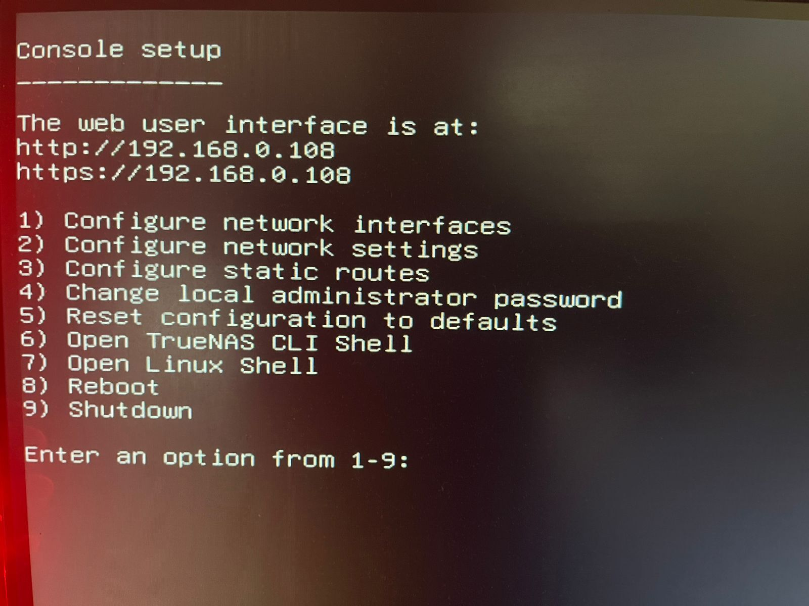

# Home Cloud Infrastructure

**Project Goal:** Build a self-hosted, always-online personal home cloud server to replace services like Google Drive, iCloud, and Netflix using fully private hardware.

## 📖 Table of Contents
1. [Purpose](#purpose)
2. [Hardware Prerequisites](#hardware-prerequisites)
3. [Software Prerequisites](#software-prerequisites)
4. [Installation Guide](#installation-guide)
5. [Storage Configuration](#storage-configuration)
6. [Applications Setup](#applications-setup)
7. [Online Access (Cloudflare)](#online-access-cloudflare)

---

## Purpose
The main purpose of this server is to act as an alternative to cloud storage (Google Drive, OneDrive, iCloud) and streaming services (Netflix, Prime Video).
* **Backup:** Automatically backup phone/computer data, photos, and videos.
* **Privacy:** No large companies have access to data; self-hosted with full privacy.
* **Streaming:** Stream local movies and web series to any device.

---

## Hardware Prerequisites
We used the following components for this build (Total Cost: ~₹20,500):
* **CPU:** Intel Pentium Gold G6400 (2C/4T @ 4.0 GHz)
* **Motherboard:** Gigabyte H410M
* **RAM:** 16GB (2x 8GB) DDR4 2666 MHz
* **Storage:**
    * 1x 500GB NVMe SSD
    * 1x 500GB SATA HDD (2.5 inch)
    * 2x 256GB SATA SSD
* **Boot Drive:** HP USB Pendrive (64GB)
* **Other:** Monitor, Keyboard, Mouse, SanDisk USB (for installer)

---

## Software Prerequisites
We use mostly open-source software:
* **OS:** TrueNAS Scale (Linux/Debian based)
* **Cloud:** NextCloud
* **Photos:** PhotoPrism
* **Streaming:** Jellyfin
* **Management:** File Browser
* **Access:** CloudFlare Tunnel

---

## Installation Guide

### 1. Create Bootable USB
1.  Download **TrueNAS Scale ISO**.
2.  Use **Rufus** to burn ISO to a USB drive.
    * **Important:** Select **"DD Image mode"** when prompted, otherwise the installer may fail.

### 2. BIOS Settings
* Plug the USB into the server PC.
* Enter BIOS.
* **Disable Secure Boot**.
* Set USB as the **Primary Boot Device**.

### 3. Installing TrueNAS Scale
1.  Select **"Start TrueNAS Scale Installation"**.
2.  Choose the drive to install the OS on (we used the 64GB HP Pendrive).
    * *Note:* Do not select your data drives here.
3.  Once installed, remove the USB and reboot.
4.  Note the **IP Address** shown on the screen after boot.

> 
> *Installation screen showing drive selection.*

---

## Storage Configuration

We organize drives into **Storage Pools**.

### Our Setup
| Pool Name | Type | Disk(s) | Purpose |
| :--- | :--- | :--- | :--- |
| **DYAZO_SSD_240GB** | Stripe | 1x 256GB SSD | Media Library (Movies) |
| **NVME_240GB** | Stripe | 1x 256GB SSD | Apps & System default |
| **MIRROR_480GB** | Mirror | 1x 500GB HDD + 1x 500GB SSD | Secure User Data & DB |

1.  Go to **Storage** -> **Create Pool**.
2.  **Stripe:** Select for single disks (faster, less redundancy).
3.  **Mirror:** Select for critical data (duplicates data across two drives).

---

## Applications Setup

### 1. File Browser
Used to manage raw files and folders directly.
* **Install:** via Apps tab.
* **Config:** Add "Additional Storage" for every pool you want to access (e.g., Mount `/NVME_240GB` to Host Path `/mnt/NVME_240GB`).

### 2. NextCloud (Google Drive Alternative)
* **Datasets:** Create `NC_Data` (User Data) and `NC_DB` (Database) on the **Mirror Pool** for safety.
* **Install:** Select these datasets during installation settings.
* **App:** Download NextCloud app on Android/iOS and point to server IP.

### 3. Jellyfin (Netflix Alternative)
* **Datasets:**
    * Config: On Mirror Pool.
    * Media: On Standard SSD (`DYAZO_SSD_240GB`).
* **Library:** Create folders `Movies` and `Shows` using File Browser.
* **Setup:** Point Jellyfin library settings to these folders.

### 4. PhotoPrism (Google Photos Alternative)
* **Why?** Better gallery experience than NextCloud.
* **Storage:** Uses NVMe drive for speed.
* **Sync:** Connects to NextCloud storage to import photos automatically.

---

## Online Access (Cloudflare)

To access the server from outside the home without a Static IP:

1.  **Domain:** Purchase a cheap domain (e.g., `.online` or `.pw`).
2.  **Cloudflare:** Create a free account and add your site.
3.  **Tunnel:**
    * Go to **Zero Trust** -> **Network** -> **Tunnels**.
    * Create a tunnel and copy the **Token**.
    * Install **Cloudflare Tunnel** app in TrueNAS and paste the token.
4.  **Public Hostnames:**
    * Map `nextcloud.yourdomain.com` -> `192.168.x.x:9001`
    * Map `jellyfin.yourdomain.com` -> `192.168.x.x:30013`

> **Note:** For NextCloud, you must edit `config.php` via TrueNAS Shell to add your new domain to the `trusted_domains` list.

---

### Conclusion
With this setup, you have a fully private cloud for **₹20,600** (hardware + domain cost), consuming only ~₹300/month in electricity.
